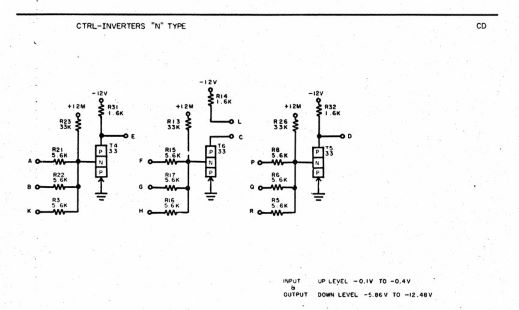
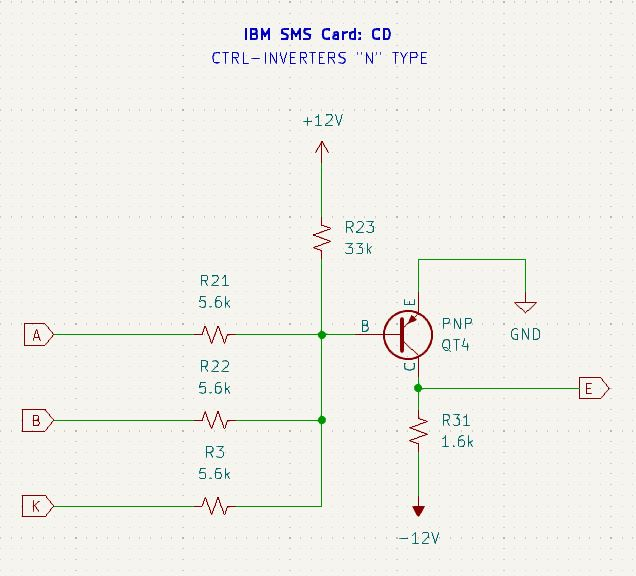
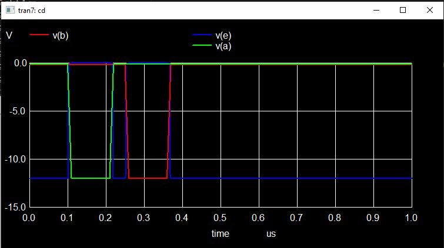

_(We provide a more in-depth documentation of this simple card for illustrative purposes.)_

[SMS Card Database Entry](https://static.righto.com/sms/CD.html)

This card provides 3x three-input NAND gates. 

The original IBM schematic is provided below. 

The CTRL designation at the top of the diagram refers to the *Complimentary Transistor Resistor Logic* family of logic cards.  In depth information can be found [in this IBM document](https://ibm-1401.info/Form223-6889-TransistorComponentCircuits.pdf).

Notice the unusual schematic representation of the transistor. The type "33" transistor was the primary transistor used on this card. This is an alloy-junction 
germanium PNP device. [This document](https://www.mikrocontroller.net/attachment/597190/TRANSISTOR_MUSEUM_HISTORIC_GERMANIUM_COMPUTER_TRANSISTORS_IBM.pdf) has some information about 
the device characteristics.

Remember that the forward "on" voltage for germanium transistors is somewhere around 0.2V.

The card is designed to operate using "S line" voltage levels. Per the notation on the diagram:
* High is -0.1V to -0.4V.
* Low is -5.86V to -12.48V.

E is low when A and B and K are high.

Here's a modern representation of the first circuit to provide better intuition:

Normally when the A/B/K inputs are at ground or above the PNP transistor is off and the E output is pulled down to the -12V supply.

If *any* of the inputs are below the -0.4v turn-on voltage of the PNP transistor then the transistor conducts and the E output is pulled up to ground.

Here's the SPICE simulation of one of the three NANDs.  The blue trace is the E output.  Notice it is only low when all inputs
are high.

### SPICE Model

~~~
* CD 
* 3x Three input NAND gate
* https://static.righto.com/images/smsdocs/1410_SMS_VOL_2055.png
* SPICE model of IBM SMS logic card
* Bruce MacKinnon 2-June-2024

.include "../ibm-sms-models.sp"

.SUBCKT SMS_CARD_CD a b c d e f g h j k l m n p q r

* Standard aliases for power pins
Rx0 vp12 n 0
Rx1 vn12 m 0

* -----

R31 vn12 e 1.6k
R23 vp12 t4_b 33k
R21 a t4_b 5.6k
R22 b t4_b 5.6k
R3 k t4_b 5.6k

* PNP transistor
* QXXXXXXX nc nb ne <ns> <tj> mname <area=val> <areac=val>
* + <areab=val> <m=val> <off> <ic=vbe,vce> <temp=val>
* + <dtemp=val>
Qt4 e t4_b 0 pnp33

* -----

R14 vn12 l 1.6k
R13 vp12 t6_b 33k
R15 f t6_b 5.6k
R17 g t6_b 5.6k
R16 h t6_b 5.6k

* PNP transistor
* QXXXXXXX nc nb ne <ns> <tj> mname <area=val> <areac=val>
* + <areab=val> <m=val> <off> <ic=vbe,vce> <temp=val>
* + <dtemp=val>
Qt6 c t6_b 0 pnp33

* -----

R32 vn12 d 1.6k
R26 vp12 t5_b 33k
R8 p t5_b 5.6k
R6 q t5_b 5.6k
R5 r t5_b 5.6k

* PNP transistor
* QXXXXXXX nc nb ne <ns> <tj> mname <area=val> <areac=val>
* + <areab=val> <m=val> <off> <ic=vbe,vce> <temp=val>
* + <dtemp=val>
Qt5 d t5_b 0 pnp33

.ENDS
~~~