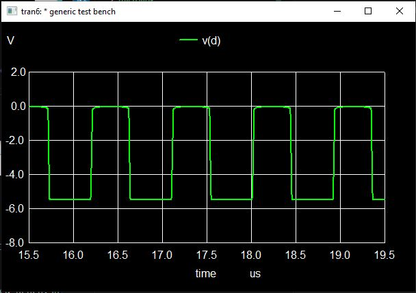

_(In-depth documentation of this interesting card for illustrative purposes.)_

[SMS Card Database Entry](https://static.righto.com/sms/TAF.html)

This card provides the 1 MHz oscillator to the entire system. Obviously, a very important 
component.

## Simulated Output

We're getting almost exactly 1 MHz here, which is the expected frequency.

