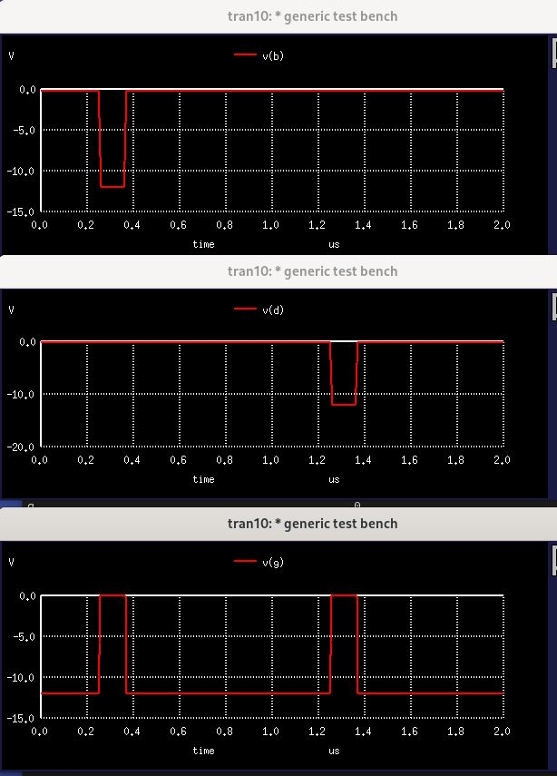

_(We provide a more in-depth documentation of this simple card for illustrative purposes.)_

[SMS Card Database Entry](https://static.righto.com/sms/TAG.html)

According to the schematic, VE and TAG* are interchangeable.

Circuit 2 provides an open collector feature.  Pin P is the collector and pin L 
is tied to -12V.

Simulation Notes
================

Pretty straight-forward.  Here's an example that shows the inverting 
AND behavior. When B or D goes low then G goes high.

